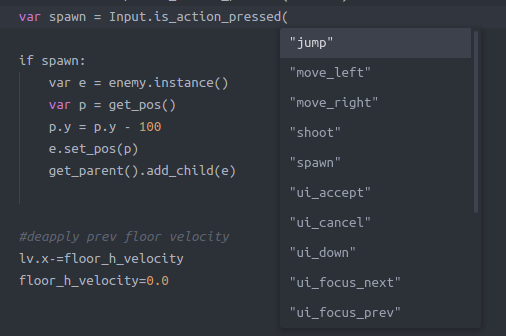
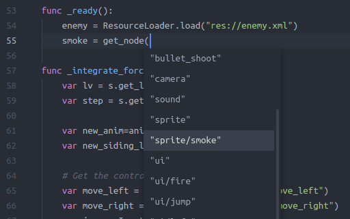
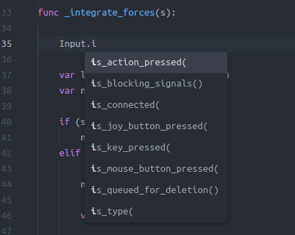

# atom-autocomplete-gdscript
This package provides GDScript completions by [gd-autocomplete-service](https://github.com/neikeq/gd-autocomplete-service) Godot's module.

For completions to work, the project that contains the edited script must be open with the Godot editor.

### Requirement:
- [lang-script](https://atom.io/packages/lang-gdscript)
- [autocomplete-plus](https://atom.io/packages/autocomplete-plus)
- [gd-autocomplete-service](https://github.com/neikeq/gd-autocomplete-service) module for Godot

### Images

